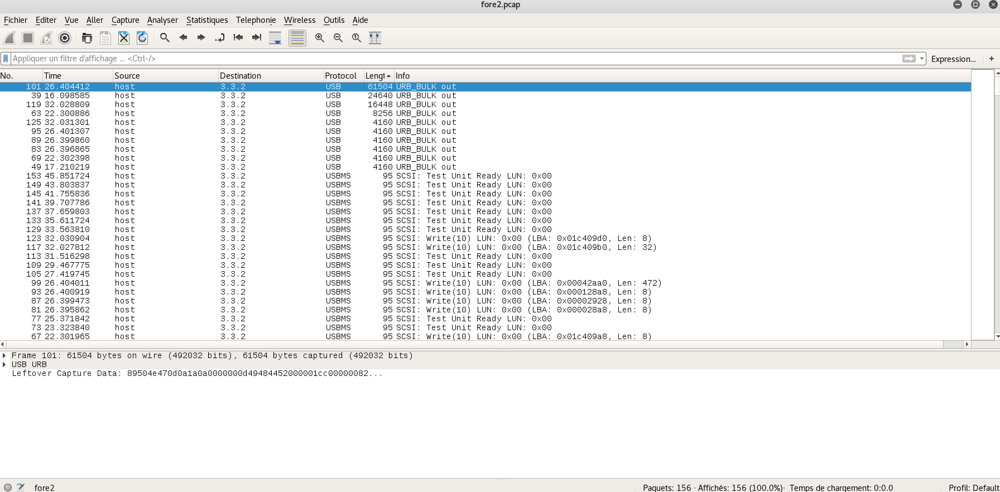

# Fore3: USB probing - forensic - 150pts

## Désignation

    Fore3: USB probing
    150

    One of our agents managed to sniff important piece of data transferred transmitted via USB, he told us that this pcap file contains all what we need to recover the data can you find it ?
    fore2.pcap

## Solution

Pour commencer, on lance un `file` pour savoir à quoi on a à faire :

    fore2.pcap: tcpdump capture file (little-endian) - version 2.4 (Memory-mapped Linux USB, capture length 262144)

L'information `tcpdump capture file` est intéressante, nous pourrons l'ouvrir avec Wireshark . Avant cela, essayons un `strings` .  
Une ligne à l'air intéressante : `Flag.mp4` . S'agissant peut-être d'un fichier caché, on lance un `binwalk` :

    root@kali:~/Documents/alexctf# binwalk fore2.pcap

    DECIMAL       HEXADECIMAL     DESCRIPTION
    --------------------------------------------------------------------------------
    62299         0xF35B          PNG image, 460 x 130, 8-bit/color RGBA, interlaced

Cela ne correspond pas à la ligne avec le `Flag.mp4`, mais une image PNG est bien à l'intérieur .  
Cette fois on lance Wireshark pour la récupérer.  
Gardant à l'esprit que l'on cherche une image, on trie les fichiers par taille.  

  

En cliquant sur la première ligne, on ouvre le paquet et on s'aperçoit qu'il contient des informations intéressantes . En effet on peut y voir `.PNG` et `Created with GIMP` .  

Il s'agit sûrement du fichier qu'on avait vu précédemment avec `binwalk` . On décide donc d'exporter le paquet pour voir cette image en fichier .png .

  

Flag !
