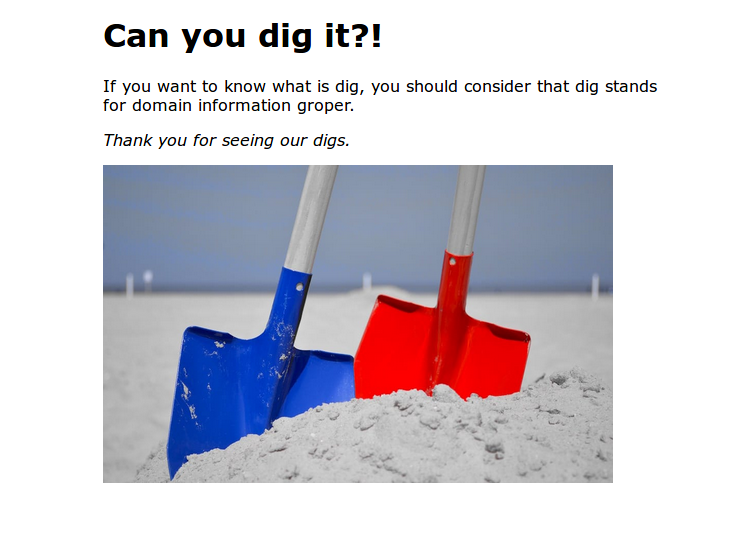
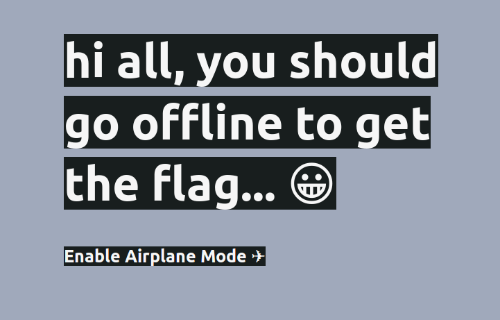
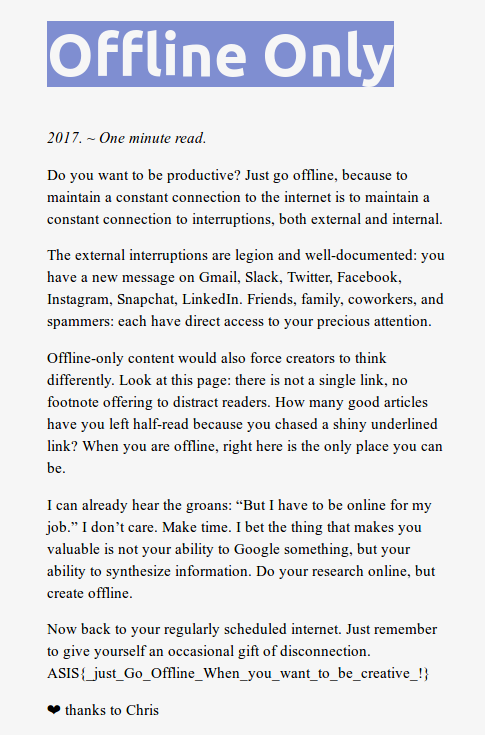

# Dig Dug - web

## Désignation

    The pot calling the kettle black.

## Solution

On clique sur kettle (lien : https://digx.asisctf.com/) pour accéder à l'épreuve et on arrive sur :

On fait rapidement le lien avec la commande `dig` donc on test : `dig digx.asisctf.com` ,
ce qui nous donne :

    ; <<>> DiG 9.10.3-P4-Ubuntu <<>> digx.asisctf.com
    ;; global options: +cmd
    ;; Got answer:
    ;; ->>HEADER<<- opcode: QUERY, status: NOERROR, id: 24772
    ;; flags: qr rd ra; QUERY: 1, ANSWER: 1, AUTHORITY: 0, ADDITIONAL: 0

    ;; QUESTION SECTION:
    ;digx.asisctf.com.		IN	A

    ;; ANSWER SECTION:
    digx.asisctf.com.	300	IN	A	192.81.223.250

    ;; Query time: 78 msec
    ;; SERVER: 127.0.1.1#53(127.0.1.1)
    ;; WHEN: Sat Sep 09 15:04:19 CEST 2017
    ;; MSG SIZE  rcvd: 50

On a l'ip 192.81.223.250 et
en faisant une recherche sur shodan (on aurait pu le faire via dig...) avec cette ip, on obtient l'hostname airplane.asisctf.com.

On décide donc de se rendre sur le site :

Il insiste pour nous mettre offline et en coupant le wifi, la page est modifiée:

Flag : ASIS{_just_Go_Offline_When_you_want_to_be_creative_!}
