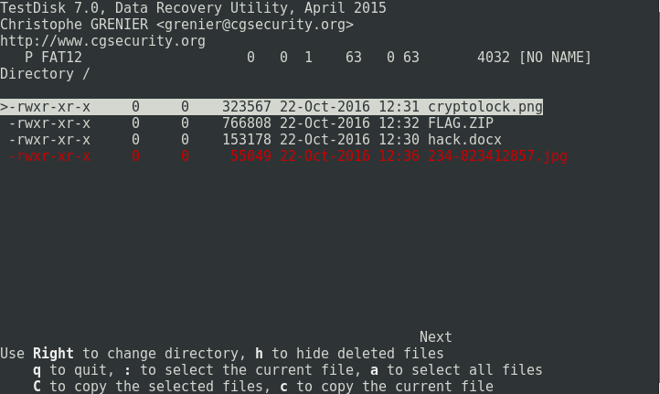

# My USB - Forensics - 150 pts

## Désignation

Forensics

Written by neptunia

I found my usb from a long time ago . I know there's a flag on there somewhere; can you help me find it?

fichier : 2c370b79d147127064f019dcb05bba1aa917c552_usb.img

## Solution

On commence directement en éxecutant un `file 2c370b79d147127064f019dcb05bba1aa917c552_usb.img` pour obtenir des informations sur le fichier .  
La réponse est la suivante :

    usb.img: DOS/MBR boot sector, code offset 0x3c+2, OEM-ID "MSDOS5.0", reserved sectors 8, root entries 512, sectors 4096 (volumes <=32 MB) , Media descriptor 0xf8, sectors/FAT 12, sectors/track 63, heads 1, hidden sectors 1, serial number 0x56d69f15, unlabeled, FAT (12 bit)

Cela confirme qu'il s'agit bien d'une clef usb.  
Nous pouvons donc lancer l'outil `testdisk` afin de voir le contenu de la clef, retrouver des fichiers potentiellement cachés ou supprimés .  
On arrive vite à ceci :

La ligne en rouge signifie un fichier supprimé . On le copie et on l'extrait dans notre répertoire, ce qui nous donne :

Flag !
