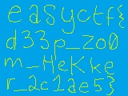

# Zooooooom - Forensics - 85 pts

## Désignation

Forensics

Written by blockingthesky

Hekkerman is looking awfully spooky. That hekker glare could pierce a firewall. What can he see that you can't?

Hint : Sometimes there's more than meets the eye.

fichier : d9040024afd9d38b73c72e30f722cf09e1093e3c_hekkerman.jpg

## Solution

Après plusieurs tentatives telles que `strings`, `binwalk` et d'autres commandes, rien d'intéressant n'apparaît.  

En relisant l'intitulé et surtout le titre Zooooooom, un idée nous vient de récupérer le thumbnail de l'image .  
Avec l'outil `exiftool`, on éxecute la commande suivante :  

    exiftool -b -ThumbnailImage d9040024afd9d38b73c72e30f722cf09e1093e3c_hekkerman.jpg > thumb.jpg

Ce qui nous donne :

Intéressant ! Et si on faisait la commande une deuxième fois !

Flag !
