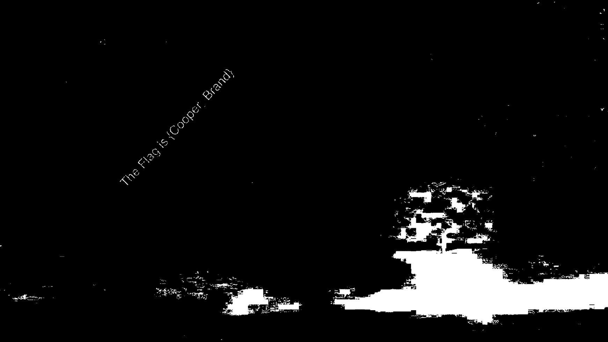

# Interstellar - Forensics - 150 pts

## Désignation

Dr. Cooper, on another one of his endless journeys encounter a mysterious planet . However when he tried to land on it, the ship gave way and he was left stranded on the planet . Desperate for help, he relays a message to the mothership containing the details of the people with him . Their HyperPhotonic transmission is 10 times the speed of light, so there is no delay in the message . However, a few photons and magnetic particles interefered with the transmission, causing it to become as shown in the picture . Can you help the scientists on the mothership get back the original image?

NOTE :- Please enclose the flag in the format pragyanctf{<flag>}.

Example :- If the flag is 'HelloWorld' (without quotes) , input it as pragyanctf{HelloWorld}
If the flag is {HelloWorld}, input it as pragyanctf{HelloWorld}
If the flag is pragyanctf{HelloWorld}, input it as pragyanctf{HelloWorld}.

transmission.png

835e80fa30befab1541fd3cb361c750f

## Solution

On éxecute les mêmes commandes que pour le premier challenge .  
La première : `file transmission.png` , ce qui nous donne :

    transmission.png: PNG image data, 1920 x 1080, 8-bit/color RGBA, non-interlaced

Un fichier image toute simple... On regarde ensuite si il y a quelque chose de caché avec `binwalk transmission.png` :

    DECIMAL       HEXADECIMAL     DESCRIPTION
    --------------------------------------------------------------------------------
    0             0x0             PNG image, 1920 x 1080, 8-bit/color RGBA, non-interlaced
    41            0x29            Zlib compressed data, default compression

On enchaine avec Stegsolve . En mettant l'image en Gray bits (comme l'épreuve précédente...), on obtient l'image suivante :  

Le flag est donc : pragyanctf{Cooper_Brand} .

Je suis pas sur que ça vallait les 150 pts...
