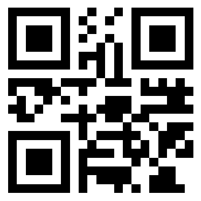

# Look Harder - Forensics - 50 pts

## Désignation

There are rumours that in the Great Sahara Desert, a great treasure has been buried deep inside the ground, but the map for the exact location of the treasure over the years, has not been preserved properly.
You have got hold of the map, but it looks nothing more than a plain white sheet of paper. Can you make sense out of it ??

NOTE :- Please enclose the flag in the format pragyanctf{<flag>}.

Example :- If the flag is 'HelloWorld' (without quotes) , input it as pragyanctf{HelloWorld}
If the flag is {HelloWorld}, input it as pragyanctf{HelloWorld}
If the flag is pragyanctf{HelloWorld}, input it as pragyanctf{HelloWorld}.

treasure_map.png

3173e19a8cd0cebca5ecb7ea8f8ddb0b

## Solution

On lance un `file treasure_map.png` , ce qui nous donne :

    treasure_map.png: PNG image data, 400 x 400, 1-bit colormap, non-interlaced

Ok, donc une image toute simple . On va maintenant regarder si il n'y pas quelque chose de caché à l'intérieur avec un `binwalk treasure_map` :

    DECIMAL       HEXADECIMAL     DESCRIPTION
    --------------------------------------------------------------------------------
    0             0x0             PNG image, 400 x 400, 1-bit colormap, non-interlaced
    59            0x3B            Zlib compressed data, default compression

Rien à signaler non plus...  
On enchaine en lançant Stegsolve .  
En mettant l'image en Gray bits, un Qr code est affiché :

En scannant le Qr code on obtient : stay_pragyaned  
Le flag est donc tout simplement : pragyanctf{stay_pragyaned} .
