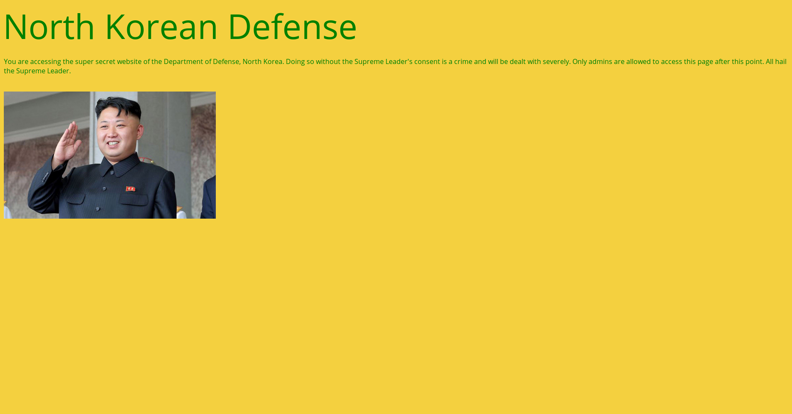

# Supreme Leader - Web - 150 pts

## Désignation

North Korea reportedly has a bioweapon in the making. Hack into their database and steal it.

Link : http://139.59.62.216/supreme_leader

NOTE :- Please enclose the flag in the format pragyanctf{<flag>}.

Example :- If the flag is 'HelloWorld' (without quotes) , input it as pragyanctf{HelloWorld}
If the flag is {HelloWorld}, input it as pragyanctf{HelloWorld}
If the flag is pragyanctf{HelloWorld}, input it as pragyanctf{HelloWorld}.

## Solution

On lance Firefox et on entre l'url, ce qui nous donne :  

Une analyse du code source ne donne rien d'intéressant, essayons un `curl -v http://139.59.62.216/supreme_leader/` :

    *   Trying 139.59.62.216...
    * Connected to 139.59.62.216 (139.59.62.216) port 80 (#0)
    > GET /supreme_leader/ HTTP/1.1
    > Host: 139.59.62.216
    > User-Agent: curl/7.47.0
    > Accept: */*
    >
    < HTTP/1.1 200 OK
    < Date: Sat, 04 Mar 2017 14:17:30 GMT
    < Server: Apache/2.4.7 (Ubuntu)
    < X-Powered-By: PHP/5.5.9-1ubuntu4.20
    < Set-Cookie: KimJongUn=2541d938b0a58946090d7abdde0d3890_b8e2e0e422cae4838fb788c891afb44f; expires=Sat, 04-Mar-2017 14:17:40 GMT; Max-Age=10
    < Set-Cookie: KimJongUn=TooLateNukesGone; expires=Sat, 04-Mar-2017 14:17:41 GMT; Max-Age=10
    < Vary: Accept-Encoding
    < Content-Length: 1117
    < Content-Type: text/html
    <
    <html>
      <head>
        <title>Defense, North Korea</title>
        <link href="https://fonts.googleapis.com/css?family=Open+Sans" rel="stylesheet">
        
        <title>Find Me</title>
      </head>
      <body>
        <h2>North Korean Defense&nbsp;</h2>
        

          
You are accessing the super secret website of the Department of Defense,     North Korea.
             Doing so without the Supreme Leader's consent is a crime and will be dealt with severely.
             Only admins are allowed to access this page after this point.
             All hail the Supreme Leader.
          

           
          
        

      </body>
    </html>
    * Connection #0 to host 139.59.62.216 left intact

Deux lignes attirent notre attention :

    < Set-Cookie: KimJongUn=2541d938b0a58946090d7abdde0d3890_b8e2e0e422cae4838fb788c891afb44f; expires=Sat, 04-Mar-2017 14:17:40 GMT; Max-Age=10
    < Set-Cookie: KimJongUn=TooLateNukesGone; expires=Sat, 04-Mar-2017 14:17:41 GMT; Max-Age=10

On voit que deux cookies sont envoyés l'un après l'autre .  
Le premier a pour valeur : `2541d938b0a58946090d7abdde0d3890_b8e2e0e422cae4838fb788c891afb44f` .  
Cela ressemble fortement a du md5 et en le convertissant on obtient : send_nukes .

Le flag est donc : pragyanctf{send_nukes} .
